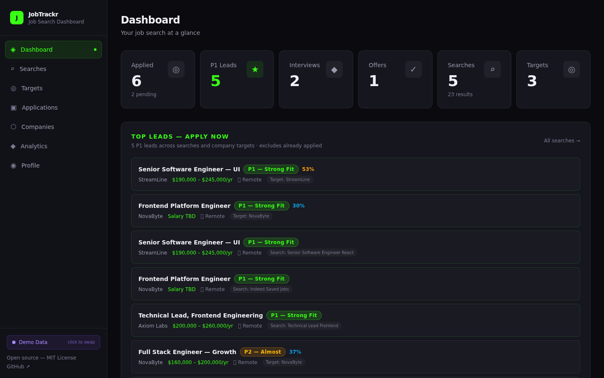
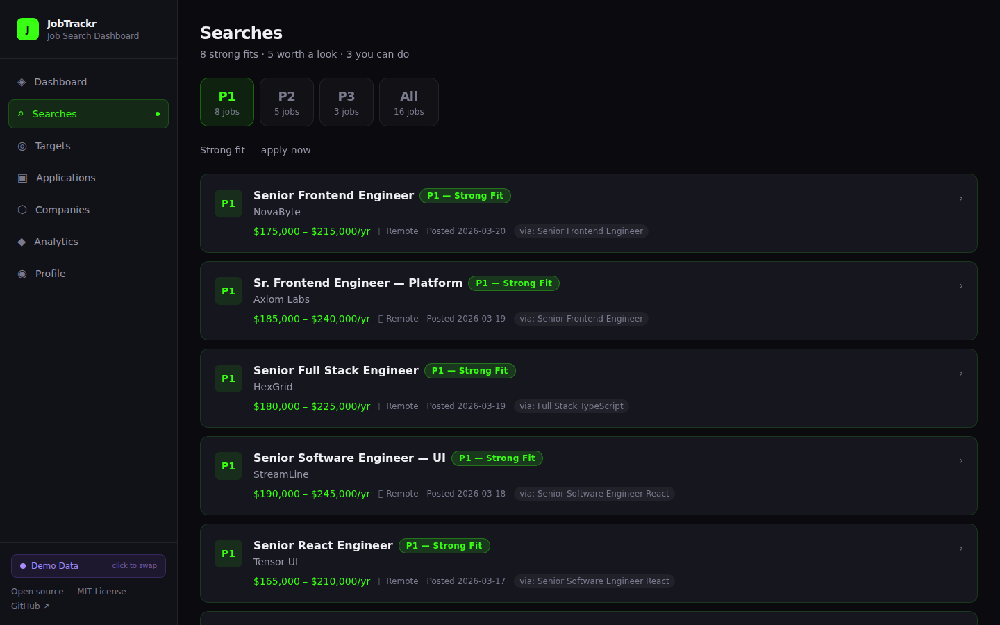
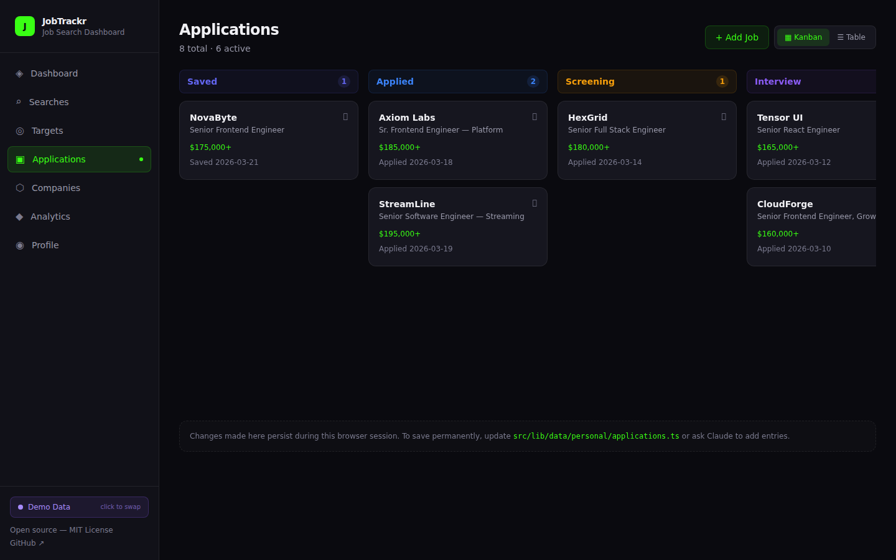
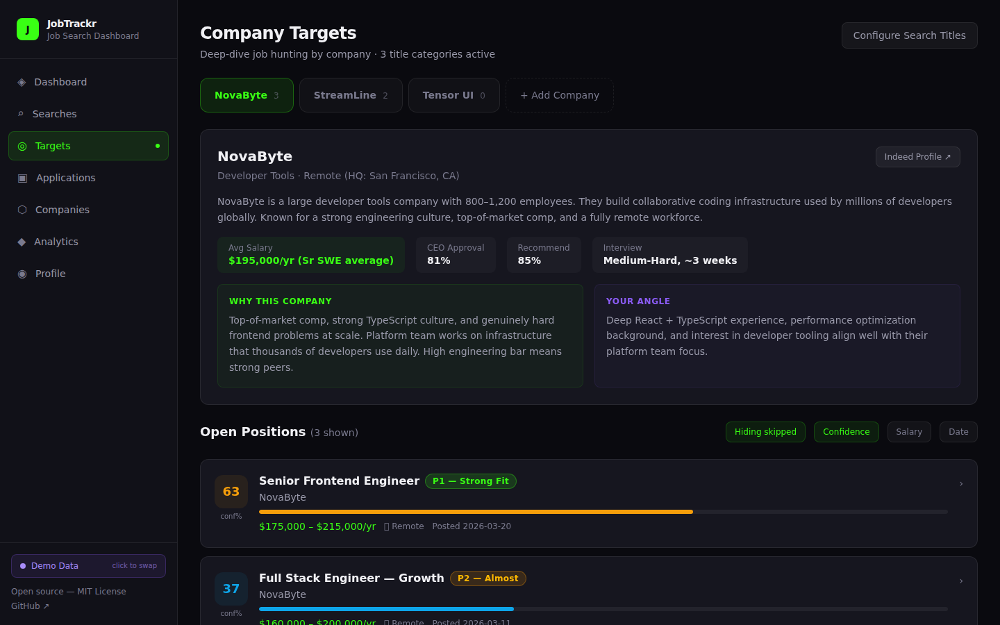
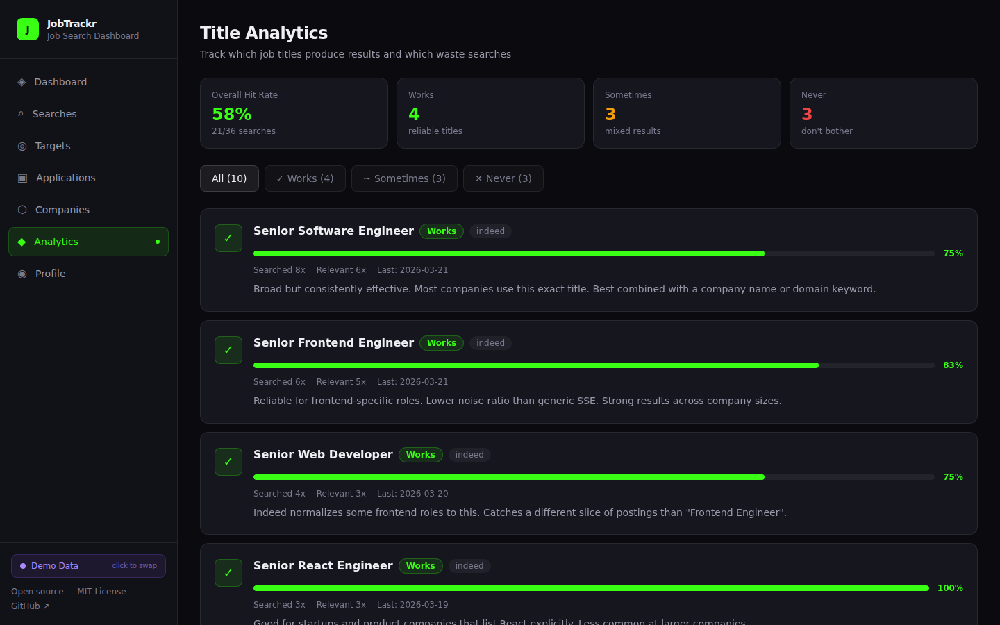
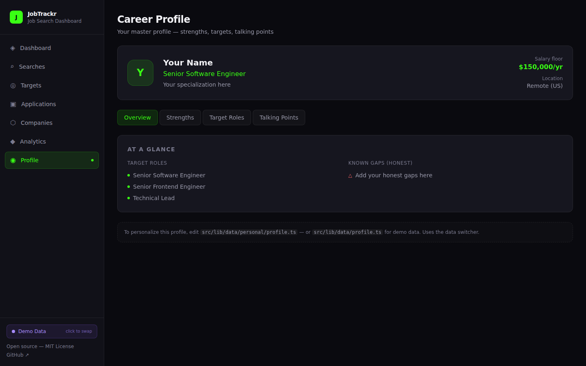

# JobTrackr

A job search dashboard for engineers who'd rather edit TypeScript than drag cards around in Trello.

No magic. No "AI finds your dream job" nonsense. You do the searching, you make the decisions, this gives you a clean interface to track it all and stop losing leads in browser tabs and half-finished spreadsheets.


### Dashboard — stats, top leads, pipeline at a glance



### Searches — priority-tiered job listings (P1/P2/P3)



### Applications — Kanban board with status tracking



---

## Who This Is For

You're a developer looking for work. You know what you're worth, you know what stack you want, and you don't need a chatbot to tell you what jobs to apply for. What you need is:

- A place to dump search results without them disappearing into the void
- A way to rank jobs by how well they actually fit your profile — not by Indeed's algorithm
- A system to track which search terms work and which are a waste of time
- A dashboard that loads instantly and doesn't ask you to sign up for anything

If you want an app that auto-applies to 500 jobs and writes your cover letter, this isn't it. If you want a sharp tool for managing a focused, intentional job search — keep reading.

---

## Features

- **Priority Tiers (P1/P2/P3)** — Every job gets a tier. P1 = strong fit, apply now. P2 = worth a look. P3 = you could do it. Skip = don't bother. Focus your energy where it matters.
- **Company Targets** — Pick a company, see all their open roles scored by confidence %, sorted by fit. Includes company intel (salary averages, CEO approval, interview difficulty) and your strategic angle for each target.
- **Confidence Scoring** — Auto-calculated 0-100% match based on title keywords, seniority, role type, salary range, and remote availability. Customize the weights in `targets.ts` to match your own profile.
- **Title Analytics** — Which job title searches actually produce relevant results? Track verdicts (Works / Sometimes / Never) so you stop repeating dead-end queries.
- **Inline JDs** — Job descriptions render inside the app when available. No tab-switching to Indeed.
- **Application Pipeline** — Kanban board and table view: Saved → Applied → Screening → Interview → Offer → Accepted / Rejected.
- **Deploy-Ready Tracking** — See which applications have cover letter + portfolio packages built and ready to submit.
- **Demo/Live Toggle** — Switch between demo data (for screenshots) and your real data with one click. Persists across reloads via localStorage.
- **Indeed Saved Jobs Import** — If you can grab the JSON from Indeed's saved jobs API, the data maps directly into the search results format with metadata like `normalizedJobTitle`, `easyApply`, and `expired` status.

### More Screenshots

<details>
<summary>Company Targets — confidence scoring + company intel</summary>


</details>

<details>
<summary>Title Analytics — track which searches work vs waste time</summary>


</details>

<details>
<summary>Profile — strengths, targets, talking points</summary>


</details>

### Priority Tiers

| Tier | Meaning | Color |
|---|---|---|
| **P1** | Strong fit — apply now | Green |
| **P2** | Almost — worth a look | Amber |
| **P3** | You can do this | Blue |
| **Skip** | Not a fit | Gray |

---

## Tech Stack

| Layer | Technology |
|---|---|
| Framework | [SvelteKit](https://kit.svelte.dev/) with Svelte 5 (runes: `$state`, `$derived`, `$props`) |
| Styling | [Tailwind CSS v4](https://tailwindcss.com/) via `@tailwindcss/vite` |
| Language | [TypeScript](https://www.typescriptlang.org/) — strict, fully typed data layer |
| Runtime | [Bun](https://bun.sh/) — fast installs, fast dev server |
| Data | Plain TypeScript files — no database, no auth, no backend |
| Theme | Dark mode, `#39FF14` neon green accent |

---

## Getting Started

```bash
git clone https://github.com/NooRotic/JobTrackr.git
cd JobTrackr
bun install
bun run dev
```

Open [http://localhost:5173](http://localhost:5173). The app ships with example data so you can see how everything works.

---

## Making It Yours

All data lives in `src/lib/data/`. Plain TypeScript files with typed interfaces. No database, no migration, no setup wizard. Open the file, edit the data, save, and the dev server hot-reloads.

| File | What it does |
|---|---|
| `searches.ts` | Your saved job searches with results and priority tiers |
| `targets.ts` | Company targets, job title categories, confidence scoring algorithm |
| `titleAnalytics.ts` | Job title effectiveness tracking |
| `applications.ts` | Application pipeline entries |
| `companies.ts` | Company research cards |
| `activity.ts` | Activity feed |
| `profile.ts` | Career profile data |
| `types.ts` | All TypeScript interfaces — extend as needed |

Replace the example data with your own. That's it.

### Keeping Your Data Private

Your real job search data should not live in a public repo. The `.gitignore` already excludes `src/lib/data/personal/`. Keep your real data files there — the app loads personal data by default and falls back to demo data. Toggle between them with the sidebar button or `?demo=true` URL param. Your preference persists in localStorage across reloads.

---

## Power User: Claude Code + Indeed MCP

JobTrackr was built alongside [Claude Code](https://claude.ai/code) with the [Indeed MCP plugin](https://docs.anthropic.com/en/docs/agents-and-tools/claude-code). This is entirely optional — the dashboard works fine with manually entered data — but if you have this setup, the workflow gets significantly faster:

**What Claude Code + Indeed MCP enables:**
- `search_jobs` — Run Indeed searches by keyword, location, and job type. Results map directly into `searches.ts` format.
- `get_job_details` — Pull full job descriptions by job ID. Populates the `jobDescription` field for inline JD viewing.
- `get_company_data` — Pull company ratings, salary averages, CEO approval, interview difficulty. Populates company target cards.
- `get_resume` — Verify how Indeed parsed your uploaded resume.

**The workflow:**
1. Tell Claude: "Search YouTube for Senior Software Engineer roles"
2. Claude runs the searches, scores results, assigns priority tiers
3. Claude writes the results directly into your data files
4. Dashboard hot-reloads with new results

**What it does NOT do:**
- Apply for jobs on your behalf
- Write cover letters or resumes
- Make decisions about which jobs to pursue
- Anything automatically — you ask, it executes, you decide

This is a power tool, not an autopilot.

---

## Project Structure

```
src/
  lib/
    components/       # StatusBadge, FitBadge, PriorityBadge, DeployBadge, StatCard
    data/             # All typed data files (example data ships with repo)
      personal/       # Your real data (gitignored)
  routes/
    +layout.svelte    # Root layout with sidebar nav + demo/live toggle
    +page.svelte      # Dashboard home (stats, leads, pipeline, activity)
    searches/         # Priority-tiered job board (P1/P2/P3)
    targets/          # Company-targeted search with confidence scoring
    applications/     # Kanban board + table view with add/edit
    companies/        # Company research card grid
    analytics/        # Job title effectiveness tracking
    profile/          # Career profile with talking points
```

---

## Building for Production

```bash
bun run build
bun run preview
```

Deploy to Vercel, Cloudflare Pages, GitHub Pages, or any static host with the appropriate SvelteKit adapter.

---

## Contributing

PRs welcome. This is intentionally minimal — no database, no auth, no server-side rendering of dynamic data. The goal is a fast, portable dashboard that any developer can fork and run locally in under a minute.

If you're adding features, keep them opt-in and data-file driven. The core value is simplicity.

---

## License

MIT — see [LICENSE](./LICENSE).
